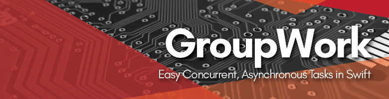

<p align="center">
  
</p>


[](https://swift.org)
[](https://cocoapods.org/pods/GroupWork)
[](https://cocoapods.org/pods/GroupWork)
[](https://cocoapods.org/pods/GroupWork)
[](https://github.com/Carthage/Carthage)
[](https://travis-ci.org/quanvo87/GroupWork)
[](http://opensource.org/licenses/MIT)

GroupWork is an easy to use Swift framework that helps you orchestrate your concurrent, asynchronous functions in a clean and organized way. This helps make large functions with multiple asynchronous tasks more clear and easy to follow.

## Contents

1. [Requirements](#requirements)
2. [Installation](#installation)
    - [CocoaPods](#cocoapods)
    - [Carthage](#carthage)
    - [Swift Package Manager](#swift-package-manager)
    - [Manually](#manually)
3. [Documentation](#documentation)
4. [Example Usage](#example-usage)
5. [Working Example](#working-example)
6. [License](#license)
7. [Authors](#authors)

## Requirements

[Swift 4](https://swift.org/)

## Installation

#### CocoaPods

For [CocoaPods](http://cocoapods.org/), add to `Podfile`:

```ruby
pod 'GroupWork', '~> 0.0'
```

#### Carthage
For [Carthage](https://github.com/Carthage/Carthage), add to `Cartfile`:

```
github "quanvo87/GroupWork"
```

#### Swift Package Manager

For [SPM](https://swift.org/package-manager/), add to your package dependencies:

```
.package(url: "https://github.com/quanvo87/GroupWork.git", .upToNextMinor(from: "0.0.0"))
```

#### Manually

- for projects, drag `GroupWork.swift` to the project tree
- for workspaces, include the whole `GroupWork.xcodeproj`

## Documentation

[Here](https://quanvo87.github.io/GroupWork/)

## Example Usage

#### End Goal

```swift
import GroupWork

...

func complexFunc(completion: @escaping (Bool) -> Void) {
  let work = GroupWork()

  work.asyncFuncA()
  work.asyncFuncB()
  work.asyncFuncC()

  work.allDone() {
    completion(work.result)
  }
}

...
```

`complexFunc` is a function that returns the result of three asynchronous functions `asyncFuncA()`, `asyncFuncB()`, and `asyncFuncC()`, running concurrently. The completion handler is called only when all these functions have completed. Usage of this library has enabled the above clean interface. This can be scaled to much higher than three asynchronous functions.

notes:
  - the asynchronous functions should be able to run concurrently without affecting each other
  - `work.result` is only a simple `Bool`
  - this is not an answer to [callback hell](http://callbackhell.com/)

#### Set Up

There is some set up required in order to create `complexFunc()` from above:

```swift
import GroupWork

extension GroupWork {
  func asyncFuncA() {
    start()
    networkCallA() { (result) in
      self.finish(withResult: result)
    }
  }

  func asyncFuncB() {
    start()
    networkCallB() { (result) in
      self.finish(withResult: result)
    }
  }

  func asyncFuncC() {
    start()
    networkCallC() { (result) in
      self.finish(withResult: result)
    }
  }
}
```

Now you can create a `GroupWork`, and call `work.simpleFuncA()` on it like in the example.

notes:
  - `start()` must be called before an asynchronous task
  - `finish()` must be called in the completion handler of an asynchronous task
  - `start()` and `finish()` calls must be balanced

## Working Example

The [tests](Tests/GroupWorkTests/GroupWorkTests.swift) have a working example.

## License
[MIT](http://opensource.org/licenses/MIT) [LICENSE](LICENSE)

## Authors

- [Quan Vo](https://github.com/quanvo87)
- [Wilson Ding](https://github.com/dingwilson)
- Banner: [Michelle Law](http://dropr.com/mlaw)

*Please provide attribution, it is greatly appreciated.*
